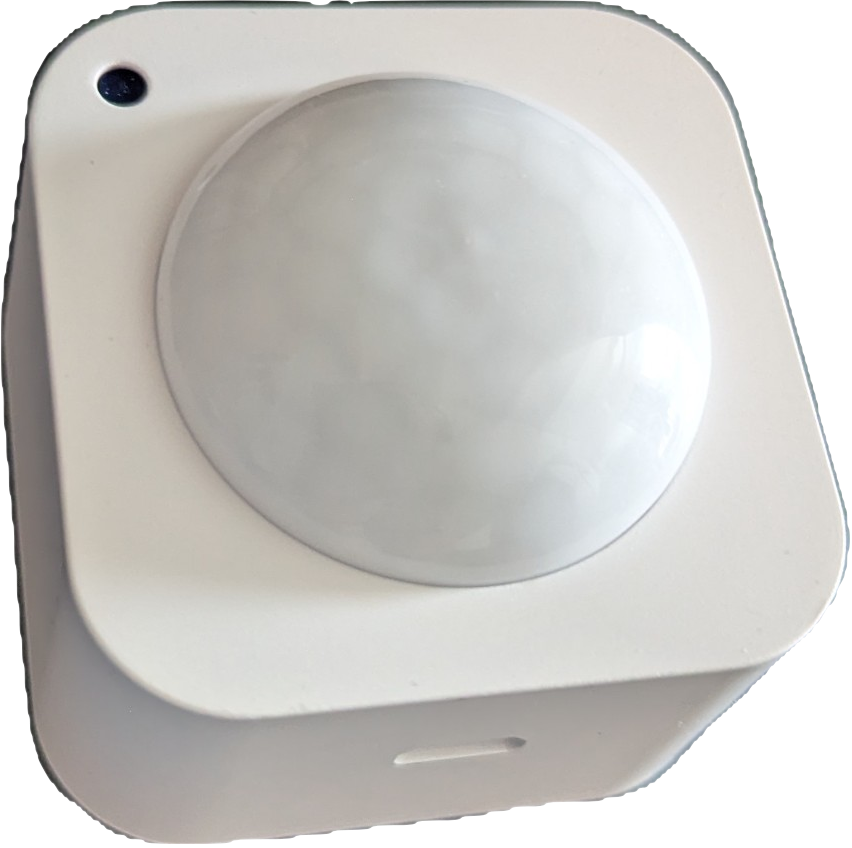

# Home Assistant support for Tuya Bluetooth motion sensor device

## Overview

This integration supports Tuya motion & brightness detector SBLM04 connected via BLE.

_Inspired by code of [@PlusPlus-ua](https://github.com/PlusPlus-ua/ha_tuya_ble)_

## Installation

Install via [HACS](https://hacs.xyz/).

Restart Home Assistant after installation.

## Usage

After adding to Home Assistant integration should discover the Bluetooth device, or you can add a device manually.

The integration works locally, but connection to Tuya BLE device requires device ID and encryption key from Tuya IOT cloud. It could be obtained using the same credentials as in official Tuya integration. To obtain the credentials, please refer to official Tuya integration [documentation](https://www.home-assistant.io/integrations/tuya/)

## The only supported device for now:

* Motion Brightness Sensor (category_id 'ldcg')
  + SBLM04 (product_id 'lel5afa4'), powered by CR2 battery or USB type C.
